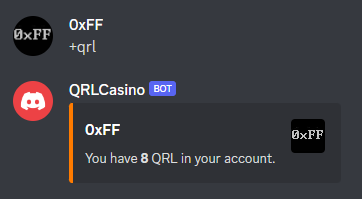
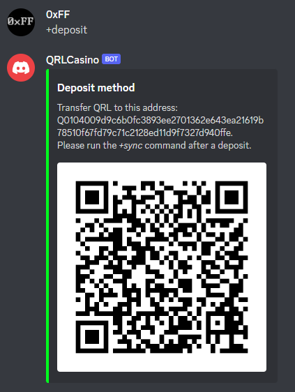

# QRLCasino

QRLCasino is a gambling discord bot. It use [QRL](https://www.theqrl.org/) as the deposit method.

This project is a PoC developped during the [QRL Winter Hackathon 2022](https://www.theqrl.org/events/qrl-games-winter-hackathon-2022/).

Commands     |  Screenshot
:-------------------------:|:-------------------------:
Slots |  
   

Blackjack | 
   

Flip | 
   

Roll | 
   

Help | 
   

QRL | 
   

Faucet | 
   

Deposit | 
   

Withdraw | 
   

Sync | 
   

Leaderboard | 
   

## Installation
(tests were done with Ubuntu 20.04)

0) Open a terminal and install git

		sudo apt install git

1) Download this project. 

	    git clone https://github.com/0xFF0/QRLCasino.git

2) Make the scripts executable.

	    chmod +x Start_QRLCasino.sh

3) Edit config file. 

		$ gedit config.yml
		
	
					
	| Variable    | Description |
	| ----------- | ----------- |
	| token | Discord bot token.  | 
	| owners_id | Discord user id, enable hidden commands for these users. |
	| prefix | Command prefix. |
	| default_bet | 1 QRL default bet. |
	| bonus_multiplier | Default bet x bonus multiplier = faucet giveaway. |
	| bonus_cooldown | Limit faucet every X hours. |
	| qrl_addr | Casino QRL main address. Private key needs to be in qrlData/Mainet/walletd.json  |

4) Run the script to setup and install everything.

	    ./Start_QRLCasino.sh	

## Credits

Code based on https://github.com/ConnorSwis/casino-bot.

